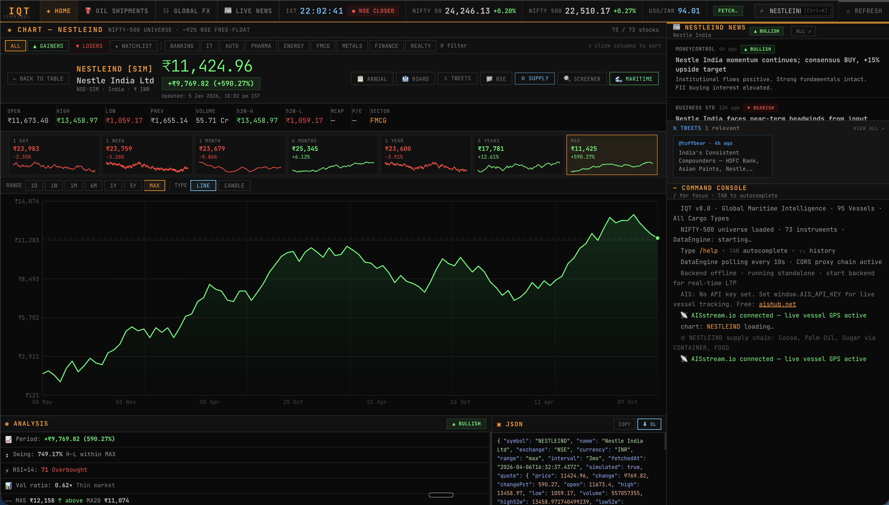

# IQT Terminal

## Overview
IQT Terminal is a Bloomberg-style financial intelligence platform focused on Indian markets.

## Features
- Real-time tracking of Nifty 500 stocks
- Global monitoring (flights, maritime)
- Interactive dashboards
- AI integration planned using Claude

## Vision
To make powerful financial tools accessible to everyone.

## Status
Actively under development 🚀
## Screenshots

## Screenshots

 

## Demo
Open index.html to view the prototype interface

Update: Improved project description clarity

Update: Working on UI improvements for dashboard

Update: Planning AI integration using Claude

Update: Enhancing project structure and files

