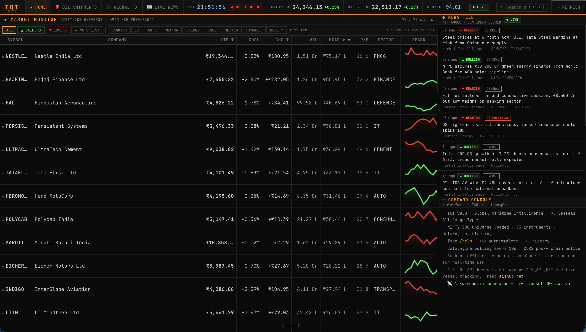

# IQT Terminal

## Overview
IQT Terminal is a Bloomberg-style financial intelligence platform focused on Indian markets.

## Features
- Real-time tracking of Nifty 500 stocks
- Global monitoring (flights, maritime)
- Interactive dashboards
- AI integration planned using Claude

## Vision
To make powerful financial tools accessible to everyone.

## Status
Actively under development 🚀
## Screenshots

## Demo
Open index.html to view the prototype interface
